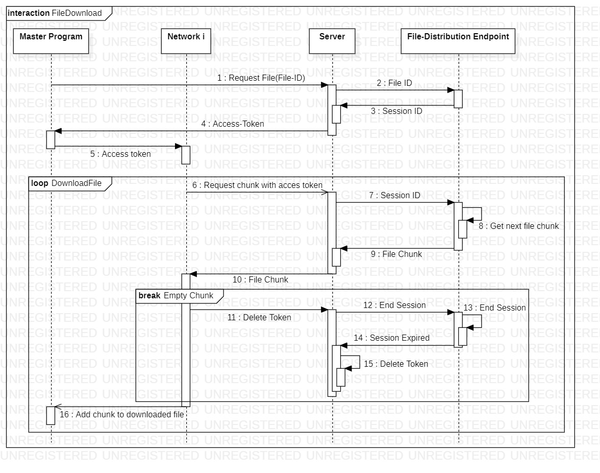

# Biternet
Biternet is a new way approach to Internet. In conventional Internet we download files from one source over a network or we download files from multiple sources over a single network, but we don't download files from a single/multiple sources over multiple networks. If small parts of file (will be referred as chunks from here) can be downloaded over multiple networks then we can increase the speed of download and get around any data limit on a single network.

Why isn't this technology not used everywhere? Well, multiple reasons: 
1. Most computers are not capable of connecting to multiple networks 
2. Most people don't have access to multiple networks
3. Internet connectivity has improved many folds in the last decade
4. Most users don't perform internet-heavy tasks that would require such solutions

## Why Biternet?
Well the justification behind biternet is quite simple: Internet is not homogenous, while the average internet speed in India is less than 1 MB per second the same for US is over 10MB ber second! This data gets even worse for Africa! So for people who wish to share files that can be as large as hundreds of GigaBytes in size, We need a better approach. It will take 3 hrs to download a file of size 100 GB over an internet with 10MBps, It will take 30 hrs for 1MBps! If we somehow download the same file over 3 differnet networks, we can reduce the download time 20hrs! This is where Biternet can solve real world problems.

## How does it work?
See the following sequence diagram: 

A master program runs and makes requests for a file, the server gets a session ID for the particular request. File-Distribution endpoint keeps tracks of the last chunk allocated to a request and prepares the next chunk for allocation.